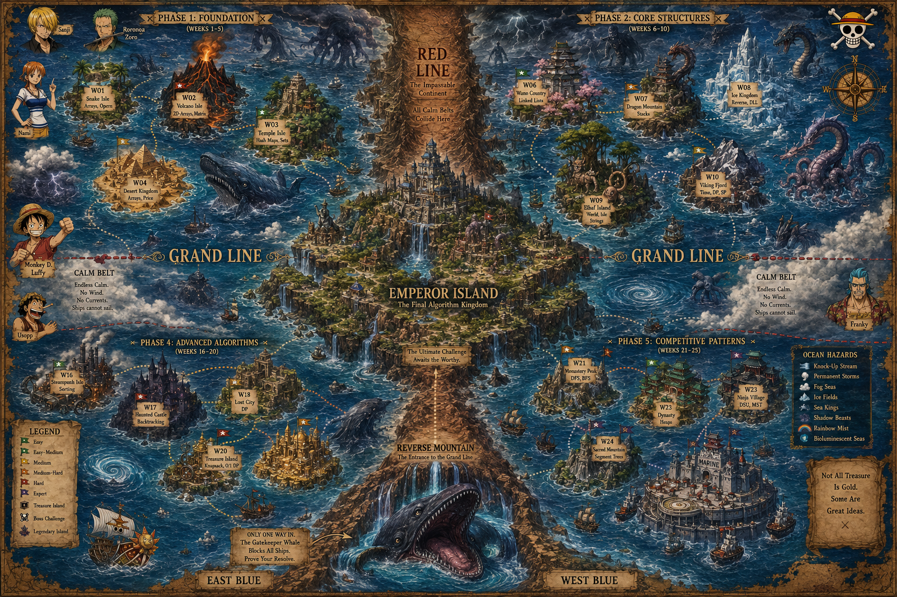

<div align="center">

```
╔════════════════════════════════════════════════════════════════════════╗
║                                                                        ║
║   ██████╗ ███████╗ █████╗       ██████╗  █████╗███╗   ███╗███████╗     ║
║   ██╔══██╗██╔════╝██╔══██╗    ██╔════╝ ██╔══██╗████╗ ████║██╔════╝     ║
║   ██║  ██║███████╗███████║    ██║  ███╗███████║██╔████╔██║█████╗       ║
║   ██║  ██║╚════██║██╔══██║    ██║   ██║██╔══██║██║╚██╔╝██║██╔══╝       ║
║   ██████╔╝███████║██║  ██║    ╚██████╔╝██║  ██║██║ ╚═╝ ██║███████╗     ║
 ║   ╚═════╝ ╚══════╝╚═╝  ╚═╝     ╚═════╝ ╚═╝  ╚═╝╚═╝     ╚═╝╚══════╝     ║ 
║                                                                        ║
╚════════════════════════════════════════════════════════════════════════╝
```
</div>

---

## 🗺️ ワールドマップ



---

## 📊 プレイヤースタッツ

```
┌────────────────────────────────────────────────────────────┐
│  PLAYER: @yourusername                                     │
│  CLASS: Weekend Warrior                                    │
│  STREAK: 3 weekends                                        │
│                                                            │
│  ┌────────────────────────────────────────────────────┐    │
│  │  DSA                                               │    │
│  │  █░░░░░░░░░░░░░░░░░░  19%  [UNLOCKED]              │    │
│  └────────────────────────────────────────────────────┘    │
│                                                            │
└────────────────────────────────────────────────────────────┘
```

---

## 🧪 ウィークテンプレート

```
week-XX-game/
├── 🎮 game/              # The playable game
├── 📝 dsa/               # DSA implementation & notes
├── ✅ tests/             # Unit tests for DSA concepts
├── 📖 README.md          # Week-specific docs
└── 🎬 demo.gif           # Screen recording
```

---

## 📂 リポジトリストラクチャー

```
dsa-grandmaster/
├── 📁 01-snake/          🐍 Arrays + Queues
├── 📁 02-tic-tac-toe/    ⭕ 2D Arrays
├── 📁 03-memory-match/   🃏 Hash Maps
├── 📁 04-brick-breaker/  🧱 Arrays + Physics
├── 📁 05-tower-of-hanoi/ 🗼 Stacks + Recursion
├── 📁 06-rhythm-tap/     🎵 Linked Lists
├── 📁 07-pixel-paint/    🎨 Stacks (Undo/Redo)
├── 📁 08-diner-dash/     🍽️ Queues
├── 📁 09-word-guess/     🔤 Strings + Hash Maps
├── 📁 10-boggle-blast/   🔡 Trie + DFS
├── 📁 11-family-tree/    🌳 Binary Trees
├── 📁 12-bst-hunter/     🔍 Binary Search Tree
├── 📁 13-minesweeper/    💣 Graphs + BFS
├── 📁 14-pac-man/        👻 Graphs + Pathfinding
├── 📁 15-er-triage/      🏥 Heaps
├── 📁 16-sort-race/      🏁 Sorting Algorithms
├── 📁 17-n-queens/       ♛ Backtracking
├── 📁 18-sudoku/         🔢 Backtracking
├── 📁 19-stair-climber/  📈 Dynamic Programming
├── 📁 20-knapsack-hero/  🎒 0/1 Knapsack
├── 📁 21-delivery-driver/🚚 Dijkstra's Algorithm
├── 📁 22-huffman/        🗜️ Greedy Algorithm
├── 📁 23-maze-generator/ 🌀 Union-Find + MST
├── 📁 24-range-query/    📊 Segment Trees
├── 📁 25-atcoder-bootcamp/ 🏆 Contest Prep
├── 📄 plan.json          
├── 📄 LICENSE
├── 📄 index.html
└── 📄 README.md

```

---

## 🛡️ LICENSE

```
MIT License — See LICENSE file.
Free to use, modify, and dominate.
```

---

<div align="center">

```
╔═════════════════════════════════════════════════════════╗
║                                                         ║
║      ███████╗████████╗ █████╗ ██████╗ ████████╗         ║
║      ██╔════╝╚══██╔══╝██╔══██╗██╔══██╗╚══██╔══╝         ║
║      ███████╗   ██║   ███████║██████╔╝   ██║            ║
║      ╚════██║   ██║   ██╔══██║██╔══██╗   ██║            ║
║      ███████║   ██║   ██║  ██║██║  ██║   ██║            ║
║      ╚══════╝   ╚═╝   ╚═╝  ╚═╝╚═╝  ╚═╝   ╚═╝            ║
║                                                         ║
║       ██████╗  █████╗ ███╗   ███╗███████╗      ██║      ║
║      ██╔════╝ ██╔══██╗████╗ ████║██╔════╝      ██║      ║
║      ██║  ███╗███████║██╔████╔██║█████╗        ██║      ║
║      ██║   ██║██╔══██║██║╚██╔╝██║██╔══╝        ██║      ║
║      ╚██████╔╝██║  ██║██║ ╚═╝ ██║███████╗       ╔╗      ║
║       ╚═════╝ ╚═╝  ╚═╝╚═╝     ╚═╝╚══════╝      ██║      ║
║                                                ╚═╝      ║
╚═════════════════════════════════════════════════════════╝
```
</div>
